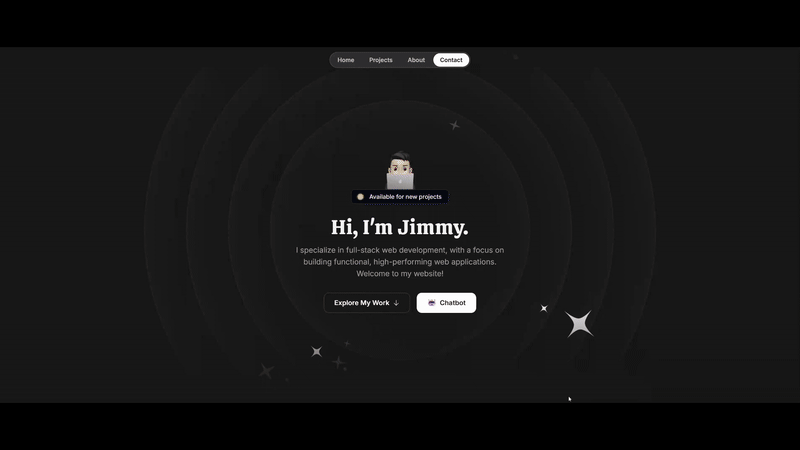

# AI Chatbot API

REST API for an AI-powered chatbot found on my [website](https://www.jimmyzhng.com). This project utilizes Retrieval-Augmented Generation, an AI technique that combines the power of large language models with external knowledge bases. It retrieves the relevant info from the source and uses that to augment the LLM's generated output, resulting in improved accuracy, up-to-date information, and relevant data. In this case, the knowledge base is information about myself, and the goal of this project is to have a personal assistant that answers any questions a user may have about me.  



## 🚀 Features

- RESTful API architecture
- PostgreSQL database integration with Sequelize ORM
- User authentication and management
- Message handling and conversation management
- Rate limiting 
- CORS enabled for cross-origin requests

## 🛠️ Tech Stack

- **Runtime:** Node.js
- **Language:** TypeScript
- **Framework:** Express.js
- **Database:** PostgreSQL
- **AI Integration:** LlamaIndex, OpenAI
- **ORM:** Sequelize

## 🔧 Installation

1. Clone the repository:
```bash
git clone <your-repository-url>
cd chatbot
```

2. Install dependencies:
```bash
pnpm install
```

3. Create a `.env` file in the root directory with the following variables:
```env
OPENAI_API_KEY=Your_API_Key
LOCAL_PSQL_USER=
LOCAL_PSQL_HOST=
LOCAL_PSQL_DB=
LOCAL_PSQL_PASS=
LOCAL_PSQL_PORT=

```

4. Run database migrations:
```bash
pnpm run migrate
```

## 🚀 Running the Application

Development mode:
```bash
pnpm run dev
```

Production mode:
```bash
pnpm start
```

## 📚 API Endpoints

### User Routes
- `POST /user` - Create a new user
- `GET /user/:id` - Get user details
- `PUT /user/:id` - Update user information
- `DELETE /user/:id` - Delete a user

### Message Routes
- `POST /message` - Send a new message
- `GET /message/:id` - Get message details
- `GET /message/conversation/:conversationId` - Get conversation history

## 🏗️ Project Structure

```
chatbot/
├── config/         # Configuration files
├── data/          # Data storage
├── db/            # Database configuration
├── middleware/    # Custom middleware
├── migrations/    # Database migrations
├── models/        # Database models
├── routes/        # API routes
├── seeders/       # Database seeders
├── server.ts      # Main application file
└── package.json   # Project dependencies
```
